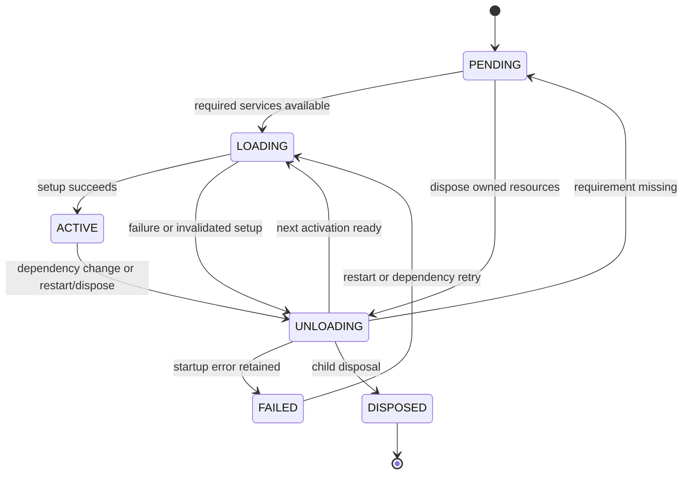

# PyCordis

PyCordis is a lightweight Python plugin runtime: plugins publish services, wait
for dependencies, register listeners and effects, and release their resources when
their owner unloads. It is independent of any web framework or agent loop and has
no runtime dependencies.

It exists to bring the ownership and reactive dependency model of Cordis to Python.
Cordis is the TypeScript reference; the primary target is the vendored Cordis 4.0.4
runtime used by DeepSeek Harness at commit
`639ed015397290b3745d163aafe02ffee4aa3f84`. PyCordis implements that runtime model,
not the Harness application or its LLM integrations. Python APIs adapt the source
where object proxies, Symbols or JavaScript execution semantics do not transfer.

**Status: version `0.1.0` prepared as an alpha API; compatibility remains partial.**
The distribution name is provisional and no release has been published in this
project work. Phase 14 prepares and verifies package artifacts. The next phase is
GitHub Readiness; publication requires a separate explicit user request. See the [current compatibility matrix](docs/compatibility.md).

## Installation from a checkout

Requires Python 3.11+ and uv. From the repository root:

```sh
uv sync --locked
uv run python examples/first_plugin.py
```

This installs the local project and its development tools into the project's
virtual environment. To use the source in another Python environment, install
this checkout with `python -m pip install /path/to/PyCordis`. There is no published
PyPI install command for this project yet.

## Start with ownership

A **Context** is a view of the runtime: metadata, service labels and caller options.
A **Fiber** owns one plugin mount's setup and cleanup. **Effects** are reversible
resources owned by that Fiber. A **PluginRuntime** records mounts sharing one
executable callback; it does not make their resources or config shared singletons.

ctx.extend, ctx.isolate and ctx.intercept create views of the same owner. Mounting
with ctx.plugin creates a child owner. Disposing a plugin drains its effects,
listeners, service bindings and nested plugins. Await the disposal handle to join
cleanup. [The mental model](docs/mental-model.md) explains ownership and snapshots
before the detailed API guides.

## First plugin

A plugin receives its Context and config. Register listeners through that Context;
return a callback for other cleanup. Run this complete example as
`uv run python examples/first_plugin.py`:

```python
import asyncio

from pycordis import Context


def greeter(ctx: Context, config: object) -> object:
    ctx.on("hello", lambda name: print("Hello,", name))
    return lambda: print("Greeter stopped")


async def main() -> None:
    root = Context()
    fiber = await root.plugin(greeter)
    root.emit("hello", "Cordis")
    await fiber.dispose()
    root.emit("hello", "listener already removed")
    assert root.registry.size == 0


if __name__ == "__main__":
    asyncio.run(main())
```

It prints `Hello, Cordis`, then `Greeter stopped`. Emitting after disposal does
nothing because the Fiber owned the listener. ctx.plugin returns the actual
awaitable Fiber; it registers ownership immediately and schedules setup.

## A named service

A Service subclass registers its instance under name. Mounting calls its
constructor, then start; any returned cleanup belongs to the mount. Run
`uv run python examples/first_service.py`:

```python
import asyncio

from pycordis import Context, Service


class Database(Service):
    name = "database"

    def start(self) -> object:
        print("Database ready:", self.config)
        return lambda: print("Database released")

    def query(self, statement: str) -> str:
        return f"{self.config}: {statement}"


async def main() -> None:
    root = Context()
    fiber = await root.plugin(Database, "connection")
    database = root.get("database")
    assert isinstance(database, Database)
    print(database.query("select example"))
    await fiber.dispose()
    assert root.get("database", False) is None


if __name__ == "__main__":
    asyncio.run(main())
```

Use ctx.get for the current visible instance. Inside an injected consumer,
ctx.require reads the loaded dependency snapshot instead. There is no implicit
close/stop/destructor hook: return cleanup or register an effect. The defining
Service.ctx remains its resource owner when callers use its methods.

## Declare dependencies

ctx.inject mounts a consumer with required service names. Its setup begins when
those bindings are available. Run `uv run python examples/dependency_injection.py`:

```python
import asyncio

from pycordis import Context, FiberState


def worker(ctx: Context, config: object) -> None:
    print("Worker uses:", ctx.require("database"))


async def main() -> None:
    root = Context()
    root.provide("database", "connection")
    fiber = await root.inject(["database"], worker)
    assert fiber.state is FiberState.ACTIVE
    await root.fiber.dispose()
    assert root.get("database", False) is None
    assert root.registry.size == 0


if __name__ == "__main__":
    asyncio.run(main())
```

This prints `Worker uses: connection`. Dependencies can also be declared with
PluginMeta or conventional inject attributes. Read requirements explicitly through
ctx.require; arbitrary ctx.database property proxies are not implemented.

## Dependencies are reactive

A missing requirement leaves a consumer PENDING. Awaiting that Fiber settles its
current work and returns; it does not wait indefinitely for a future provider.
When a provider appears, await the consumer again to settle its activation. Removing
the provider unloads the consumer; restoration starts a fresh activation. Run
`uv run python examples/reactive_services.py`:

```python
from __future__ import annotations

import asyncio

from pycordis import Context, FiberState


def consumer(ctx: Context, config: object) -> object:
    value = ctx.require("database")
    print("consumer setup:", value)
    return lambda: print("consumer cleanup:", ctx.require("database"))


async def main() -> None:
    root = Context()
    fiber = await root.inject(["database"], consumer)
    print("waiting:", fiber.state.name)
    first = root.provide("database", "first connection")
    await fiber
    pending = first()
    if pending is not None:
        await pending
    assert fiber.state is FiberState.PENDING
    root.provide("database", "replacement connection")
    await fiber
    await root.fiber.dispose()
    assert root.registry.size == 0


if __name__ == "__main__":
    asyncio.run(main())
```

Cleanup can still read the old database snapshot while the binding is being
removed. The replacement becomes the next activation's snapshot. For a class-based
provider chain and restart, run `uv run python examples/service_plugin.py`.

## Effects and cleanup

ctx.effect collects reversible setup. Awaiting the handle settles setup and keeps
the resource alive; calling the handle requests manual removal. Automatic owner
unload joins setup and cleanup already in flight. Generators can collect several
resources. Run `uv run python examples/effects.py`:

```python
from __future__ import annotations

import asyncio
from collections.abc import AsyncIterator

from pycordis import Context


async def main() -> None:
    ctx = Context()
    events: list[str] = []

    async def cleanup() -> None:
        await asyncio.sleep(0)
        events.append("async cleanup")

    async def setup() -> AsyncIterator[object]:
        events.append("setup")
        yield lambda: events.append("sync cleanup")
        yield cleanup

    effect = ctx.effect(setup, "example")
    await effect
    await ctx.fiber.dispose()  # Structural owner joins and drains the effect.
    assert events == ["setup", "async cleanup", "sync cleanup"]
    assert ctx.fiber.get_effects() == ()
    print(events)


if __name__ == "__main__":
    asyncio.run(main())
```

Within one effect, cleanup runs in reverse order. Top-level cleanup starts in
reverse registration order and may complete concurrently. PyCordis drains remaining
nested cleanup after errors, an intentional difference from the source. Resources
created through a Context belong to its Fiber, including through ordinary views.
User-created background Tasks need explicit cleanup; they are not automatically owned.

## Owned events

Use emit/bail for synchronous listeners and parallel/serial for asynchronous work.
on and once return owned Effect handles. Only None and False mean no bail result;
zero and empty values can stop serial/bail dispatch. Run
`uv run python examples/owned_events.py`:

```python
import asyncio

from pycordis import Context


def listeners(ctx: Context, config: object) -> None:
    ctx.once("notice", lambda message: print("Notice:", message))

    async def job(message: str) -> None:
        await asyncio.sleep(0)
        print("Job:", message)

    ctx.on("job", job)


async def main() -> None:
    root = Context()
    fiber = await root.plugin(listeners)
    root.emit("notice", "hello")
    root.emit("notice", "already consumed")
    await root.parallel("job", "work")
    await fiber.dispose()
    await root.parallel("job", "listener already removed")
    assert root.registry.size == 0


if __name__ == "__main__":
    asyncio.run(main())
```

The notice is delivered once; the async job runs once. Disposing their owner
removes both registrations. parallel joins all listeners and groups their errors.
Async dispatch belongs to its caller and can be cancelled; owner disposal does not
join dispatch that is already running. Child emission is root-wide unless filter_
is supplied; service isolation alone does not filter every event.

## Waterfall middleware

Each listener receives fixed arguments and a zero-argument next_ continuation.
Calling next_ runs the remaining chain and terminal; skipping it vetoes the tail.
Run `uv run python examples/waterfall.py`:

```python
import asyncio
from collections.abc import Callable

from pycordis import Context


def add(value: int, next_: Callable[[], object]) -> int:
    result = next_()
    assert isinstance(result, int)
    return value + result


async def main() -> None:
    root = Context()
    root.on("calculate", add)
    root.on("calculate", add)
    result = root.waterfall("calculate", 1, next_=lambda: 2)
    assert result == 4
    print("Result:", result)
    await root.fiber.dispose()
    assert root.fiber.get_effects() == ()


if __name__ == "__main__":
    asyncio.run(main())
```

Both layers receive 1 and the terminal returns 2, so the result is 4. The
argument is not implicitly replaced as the chain advances. For an async listener
wrapping a synchronous tail, run `uv run python examples/events.py`; await its
returned result when it is awaitable.

## Lifecycle



A child Fiber's disposal is terminal. Root Fiber disposal drains and restarts the
root, which returns to ACTIVE with uid 0. It is not terminal Context shutdown.
Setup errors are retained and rethrown by await/wait; cleanup failures are logged
and retained while other resources drain. Awaiting a lifecycle waiter is shielded
from cancellation; a setup that never settles can delay teardown. Avoid awaiting
your own or an ancestor's lifecycle from setup/cleanup.

## Scopes, declarations, config and loading

| Topic | Python API / behavior | Runnable example |
|---|---|---|
| Views and metadata | extend copies entries and shares owner identity | [basic_context.py](examples/basic_context.py) |
| Multiple mounts | Distinct Fibers/configs share one executable runtime | [basic_plugin.py](examples/basic_plugin.py) |
| Low-level lifecycle | Direct Fiber construction, restart and disposal | [basic_fiber.py](examples/basic_fiber.py) |
| Service scope | isolate and ScopeLabel select slots; matches_scope filters events explicitly | [scoped_services.py](examples/scoped_services.py) |
| Caller options | intercept layers resolve inside caller.scope() or through explicit ctx | [scoped_services.py](examples/scoped_services.py) |
| Plugin declarations | PluginMeta, PluginSpec, plugin_meta, inspect_plugin preserve callback identity | [plugin_metadata.py](examples/plugin_metadata.py) |
| Config validation | Synchronous validate returns defaults/transforms or raises; raw_config retains input | [config_validation.py](examples/config_validation.py) |
| Explicit loader | Ordered module/object entries, real Fibers, batch cleanup and rollback | [plugin_loader.py](examples/plugin_loader.py) |

Service.ctx is not transparently rebound to callers. Operation intercept options
are separate from plugin config validation. The loader imports through normal
Python rules and cannot reverse module-level side effects. Discovery, expression
files, update/persistence and hot reload remain future work.

## Compatibility and evidence

The full Python suite has 379 cases. The focused compatibility selection contains
23 source-derived behavioral cases and one catalog integrity check. The catalog
classifies 72 pinned upstream/Harness source tests and separates ports, partial
evidence and unimplemented behavior. Those counts are not a compatibility percentage.
No TypeScript suite or full Harness boot was executed.

Read the [current matrix](docs/compatibility.md),
[source-test catalog](docs/compatibility-cases.md) and
[intentional adaptations](docs/compatibility.md#intentional-differences-and-remaining-work).
Method injection/tracing, associated property proxies, LoggerService exporters,
kernel publication hooks and Fiber.update remain explicit gaps.

## Guides and development

Start with [the mental model](docs/mental-model.md) and
[the example learning path](examples/README.md). API contracts are in
[Context](docs/context.md), [plugins](docs/plugins.md), [Fiber lifecycle](docs/lifecycle.md),
[effects](docs/effects.md), [services](docs/services.md), [Service classes](docs/service.md),
[events](docs/events.md), [scope](docs/scope.md), [metadata](docs/metadata.md),
[validation](docs/config.md) and [loader](docs/loader.md).
For package installation and artifact checks, read [packaging](docs/packaging.md).
For design work, read [architecture](docs/architecture.md),
[the source audit](docs/phase-0.md) and [decisions](docs/adr/0001-phase-0-foundation.md).

```sh
uv run pytest -W error
uv run pytest -m compatibility
uv run ruff check .
uv run ruff format --check .
uv run mypy src tests examples scripts
uv build
uv run python scripts/check_distribution.py dist/pycordis-0.1.0-py3-none-any.whl dist/pycordis-0.1.0.tar.gz
```

All 16 standalone examples in [examples/README.md](examples/README.md) run from the
checkout without external services or credentials. config_validation.py intentionally
logs and catches a rejected port; that error output demonstrates structured failure.
loader_plugins.py supplies imports for the loader example and is not an entry point.

## License and attribution

PyCordis is an independent MIT-licensed Python implementation, copyright 2026
Ikram Ali. It is not affiliated with Cordis or DeepSeek. Cordis by Shigma and
DeepSeek Harness by DeepSeek are MIT-licensed behavioral references; retained
notices are in [THIRD_PARTY_NOTICES.md](THIRD_PARTY_NOTICES.md), alongside
[the project license](LICENSE). Behavioral adaptations and source provenance are
recorded in the compatibility catalog.
