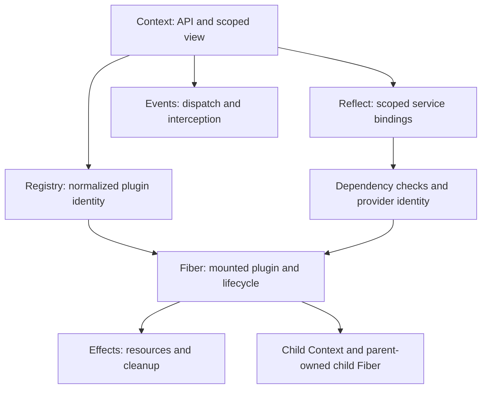

# Architecture and phase status

Phase 10 adds synchronous configuration validation; loader integration and tracing
remain future work. The phase history below describes earlier increments.

Phase 2 adds Fiber lifecycle and minimal owned cleanup to the Context foundation.
Phase 3 adds full reversible effect collection. Phase 4 adds Registry and plugin
mounting. Phase 5 adds service bindings and reactive dependency epochs. Phase 8 implements isolation and explicit intercept config resolution. Advanced
tracing below remains proposed. Phase 7 implements the
owned event bus; kernel event producers/interceptors are still future. Phase 6 adds the Service
base class on top of owned bindings. The TypeScript source separates
Context, RegistryService, Fiber, ReflectService, EventsService, Service,
LoggerService, and utilities. It has no standalone scope.ts or effects.ts.

| TypeScript source | Responsibility | Proposed Python target |
|---|---|---|
| context.ts / Context | Root API; child metadata; isolate/intercept views | context.py / Context |
| fiber.ts / Fiber, FiberState | Per-mount lifecycle; dependency epochs; config; ownership | fiber.py / Fiber, FiberState |
| fiber.ts / effect, _execute | Reversible setup; generator effects; joined cleanup | effects.py if extraction simplifies fiber.py |
| registry.ts / RegistryService, Plugin.Runtime | Normalize plugin forms; callback identity; live fibers | registry.py / Registry, PluginRuntime |
| registry.ts / Inject.resolve | Normalize dependency declarations | metadata.py / explicit declarations; services.py / dependency normalization |
| reflect.ts / ReflectService, Impl | Service slots, availability, access checks, notify, proxy hooks | reflect.py / ServiceRegistry and binding records |
| service.ts / Service | Named self-registering service; traced context; intercept config | service.py / Service |
| events.ts / EventsService | on/once; emit/parallel/serial/bail/waterfall; filters | events.py / Events |
| context.ts + reflect.ts + utils.ts | Scope labels, shadow/use context, interception | context.py initially; scope.py only if justified |
| logger.ts / LoggerService | Owned exporters; diagnostic logging | logging adapter to evaluate later |
| utils.ts / DisposableList, symbols, tracing | Ordered ownership lists, sentinels, proxy tracing | private helpers; contextvars for execution ownership |
| fiber.ts / CordisError, ValidationError | Stable error code and configuration failures | errors.py |
| loader package (separate) | Config tree and deterministic loading, eventually HMR | separate loader module/package after kernel |

## Execution flow

1. Context construction installs a root Fiber and built-in services. Root uid
   is 0 and state is ACTIVE. Bootstrap-created disposers are cleared.
2. Registry normalizes a function, constructor, or object apply method and
   shares a runtime record by executable callback identity. Every mount gets a
   fresh Fiber; registration is not a singleton-per-plugin operation.
3. Harness registers the child and assigns its parent-owned disposer BEFORE
   publishing internal/plugin. That observer can add required injections.
4. Available dependencies form an epoch containing provider Fiber uids.
   Missing requirements leave the plugin PENDING. Awaiting the Fiber settles
   current lifecycle work; it does not wait indefinitely for future providers.
5. Loading snapshots dependency bindings. After a microtask checkpoint, the
   Harness checks for a stale epoch, resolves raw config through internal/config,
   validates it synchronously, then invokes the plugin via its effect runner.
6. Dependency loss or identity change drives unload and optional reload.
   Service removal notifies matching consumers and waits for their transitions
   before deleting the provider's own snapshot entry, permitting cleanup access.
7. Parent disposal owns child cleanup even before child activation. Setup and
   in-flight teardown must finish before structural owners report completion.

## Effects and cleanup

Setup may return a disposer, promise of a disposer, iterable, or async iterable
of disposers. _execute consumes synchronous iterators immediately and checks
the epoch before advancing async iterators. The effect runner supplies the
execution context and collects yielded resources.

DisposableList.clear reverses registration order. Fiber._unload maps that
snapshot into Promise.all: top-level cleanup starts in reverse order but runs
concurrently, so completion is NOT globally LIFO. An individual effect chains
its collected disposers in reverse order. A failure inside that chain can stop
later entries; top-level teardown catches/logs each effect failure. Do not claim
all nested cleanups survive exceptions without explicit tests and a documented
policy decision. The original Python request's stronger cleanup goal may need
an intentional deviation here.

Harness makes an effect owner-visible before setup, retains async teardown
visibility until completion, joins already-running cleanup internally, rejects
new effects during UNLOADING, and allows PENDING/LOADING effects.

## Services, access, and scope

Reflect owns a root-wide store indexed by isolation labels. Duplicate providers
in one slot throw; replacement means removal followed by registration. A value
mutation through set belongs to its owning Fiber and does not itself notify
reactive consumers. Strict get checks that the provider Fiber is ACTIVE.

Attribute lookup is a different path: plugin contexts enforce injection and
walk compatible ancestor Fiber snapshots; root attribute reads are non-strict.
An explicit Python get API must choose whether to preserve the original get
escape hatch or enforce declared injection consistently. Do not conflate these.

extend inherits metadata and ownership without creating a new Fiber. isolate
creates or joins a per-service label; it is not simply a private child dict.
intercept contributes service config merged ancestor-first. Service methods are
traceable: caller scope and defining ownership both matter. contextvars can
track Python execution but alone does not reproduce the complete proxy behavior.
Events filter when an explicit dispatch object supplies a context filter;
ordinary child dispatch is not automatically isolated.

## Events

| Mode | Inspected Harness behavior |
|---|---|
| emit | Calls listeners synchronously, ignores returns; synchronous throw stops dispatch |
| parallel | Runs all, waits for allSettled, aggregates errors; dispatch telemetry reports emit |
| serial | Awaits in order and stops at first bail result |
| bail | Synchronous first bail result |
| waterfall | Shared zero-argument next continuation; omission vetoes remaining chain |

Bail excludes only null, false, undefined: 0 and empty string DO bail.
In Python, use identity checks for None/False; truthiness would be incompatible.
The request's illustrative next_(request) is not the inspected continuation
contract: listener arguments stay fixed and next takes no replacement request.
Async emit requires an explicit Python policy because calling async def only
creates a coroutine, unlike JavaScript async functions which begin execution.

## Choices to review before runtime coding

- Start with explicit get/provide; defer optional attribute lookup and define
  collisions and injection enforcement in the Phase 1/service ADR.
- Keep Context construction synchronous; decide loop binding and mounting
  semantics before Fiber. Preserve eager sync plugin/effect execution where
  relevant rather than assuming asyncio.create_task reproduces JavaScript.
- Use an awaited lifecycle-settlement method, potentially Fiber.__await__, that
  settles current work and exposes setup failure even for a PENDING plugin.
- Decide terminal ctx.dispose separately from restartable root fiber.dispose.
- Keep reverse-start concurrent owner cleanup versus nested sequential cleanup
  explicit; choose exception/cancellation/reentrant-await behavior with tests.
- Preserve Harness behavior first; consider current upstream fixes individually,
  including waterfall guards, failure latch and wrapper identity corrections.
- Version/name and build choices are provisional; no new runtime dependency,
  repository URL, or public 0.1.0 API is invented during bootstrap.

## Phase 1 implementation

See [Context guide](context.md) and [ADR 0002](adr/0002-context-foundation.md).
Context extensions share root and owner and retain an explicit parent link.
Metadata is a separate read-only mapping, not a service registry. No fake Fiber,
service store or lifecycle method is introduced to fill the architecture map.

## Phase 2 implementation

Context now creates a root Fiber synchronously; extensions share it. Direct
Fiber mounts bind their own contexts and register parent-owned cleanup before
scheduling setup. See lifecycle.md and ADR 0003 for epoch/cancellation semantics.
No service/registry/event claims follow from private epoch lifecycle tests.

## Phase 3 implementation

See effects.md and ADR 0004. Effect collection and Fiber setup share one engine.
Unlike the source fail-fast nested chain, cleanup drains all collected callbacks
before reporting errors. Diagnostics expose immutable effect trees. No registry,
service or event APIs are introduced.

## Phase 4 implementation

See plugins.md and ADR 0005. Each root owns a Registry shared by its views and
children. Callback identity shares PluginRuntime records; every mount creates
a fresh Fiber. Disposal unregisters immediately while parent ownership still
joins teardown. Remounting during old cleanup creates a protected new record.
Class plugins construct with context/config and optionally run start(). Injection,
config validation, internal notifications and service-driven epochs remain future.

## Phase 5 implementation

See services.md and ADR 0006. services.py stores root-wide binding records and
refreshes registered consumers when provider activity changes or a binding is
removed. Fiber keeps candidate bindings separately from activation snapshots.
A generation epoch invalidates setup when any required binding changes, including
replacement by the same Fiber. Owned removal joins dependent lifecycle work;
snapshots remain readable during cleanup. Explicit get preserves the source
escape hatch, while require represents declared/ancestor snapshot access.
No isolation labels, attribute proxy, accessor/mixin, trace wrappers, service
base class, internal events or intercept config are implemented by this phase.

## Phase 6 implementation

See service.md and ADR 0007. service.py adds Service(ctx, config=None, *, name=None).
The constructor registers self through Context.provide and retains its Effect
handle. Subclasses declare name and override start/check; existing class-plugin
mounting invokes start after construction. Dependencies, startup rollback,
consumer publication and restart therefore reuse the same Fiber/effect engine.
Native __call__ replaces callable-instance proxy construction. Methods retain
their defining context; tracing, extend/filter helpers and intercept resolution
are deferred until their corresponding scope/tracing phases.

## Phase 7 implementation

See events.md and ADR 0008. Each Context has a scoped Events facade sharing a
root listener store. Registrations use owned Effects; snapshot dispatch separates
inline emit/bail, concurrent all-settled parallel, ordered bail serial and waterfall
continuations. Explicit filters inspect registering contexts; global_ bypasses them.
No implicit child filter or listener-context rebinding is added. Async dispatch
belongs to its caller, while registration cleanup belongs to the defining Fiber.
Waterfall's zero-argument continuation retains fixed event arguments and can await
sync tails once an async middleware runs. Non-internal dispatch publishes diagnostic
internal/dispatch; provider/plugin/status/config interception producers are deferred.

## Phase 8 implementation

See scope.md and ADR 0009. Context views share ownership but carry immutable
isolation maps and inherited intercept layers. Service slots key by name/label;
notifications refresh only matching consumers. Owned bindings have their own
per-Fiber slot map, keeping dependency snapshots separate during cleanup.
ScopeLabel is an opaque identity token. Context.scope/current_context use a
ContextVar; setup/cleanup retain the defining view, predicates use consumer views,
and callbacks use their dispatcher's view. Service.resolve_config accepts explicit
or active callers, merges base/intercepts/head through merge_config, and validates
the caller's root/label. Service.matches_scope supplies explicit event filtering.
Proxy service attributes, automatic method context rebinding and internal kernel
interception producers are not claimed by these explicit APIs.

## Phase 9 implementation

metadata.py normalizes PluginMeta from explicit PluginSpec/decorator records or
conventional attributes. Registry resolves the executable once and snapshots its
declaration before allocation. Shared PluginRuntime retains the first snapshot;
Fiber retains per-mount metadata and dependencies. Service supports a single
provide-name fallback. Config validation and method injection remain separate.
See [metadata.md](metadata.md) and [ADR 0010](adr/0010-plugin-metadata.md).

## Phase 10 implementation

config.py defines the library-independent ConfigValidator protocol. Registry
resolves the validator callable before allocating a mount; Fiber applies it after
the loading checkpoint under the injected-service snapshot. raw_config preserves
input, config exposes the last successful resolution. ValidationIssue/Error provide
structured optional diagnostics. Failed validation uses existing rollback and
restart semantics. Loader/config waterfalls and update APIs remain future work.
