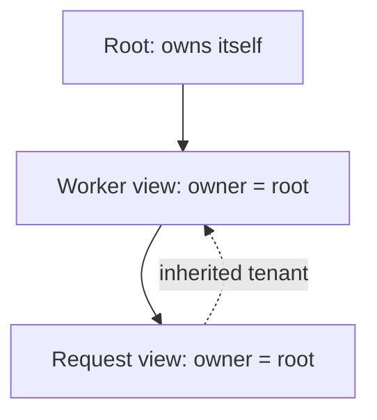

# Context views and ownership

A Context is an explicit view of application scope. Constructing one is
synchronous and requires no running event loop. It initializes root-local runtime
stores and an ACTIVE root Fiber without scheduling a Task.

```python
from pycordis import Context

root = Context()
worker = root.extend({"label": "worker", "tenant": "demo"})
request = worker.extend({"label": "request"})

assert request.parent is worker
assert request.root is root
assert request.owner is root
assert request.metadata["tenant"] == "demo"
assert request.metadata["label"] == "request"
assert worker.metadata["label"] == "worker"
```



## Public API

| API | Contract |
|---|---|
| Context() | Independent root; parent is None; root and owner are itself |
| parent | Immediate source view, read-only |
| root | Shared root Context, read-only |
| owner | Owning Context identity, read-only; not a Fiber or cleanup handle |
| metadata | Read-only Mapping[str, object], local entries over inherited entries |
| extend(meta=None) | Distinct child; same root/owner; shallow-copied mapping entries |

The `owner` context is the scope where its Fiber is bound; ctx.fiber exposes it.
roots own themselves and ordinary extensions inherit that identity. A mounted
Fiber creates a context which owns itself and binds that Fiber. Parentage
alone does not mean lifecycle ownership: extending a view never creates a new
plugin instance, allocates a task or registers cleanup.

Context.effect registers reversible setup with ctx.fiber. Context also exposes
plugin mounting, explicit service access, events, isolate and intercept. Metadata
is separate from the service registry. See [the mental model](mental-model.md)
and [services](services.md). There is no terminal Context.dispose API; root Fiber
disposal uses restart semantics.

## Inheritance and collisions

The mapping passed to extend is copied, so later changes to its entries do not
change the child. Entry values retain their identity: mutating a shared list or
resource object is visible through every context holding it. Read-only mappings
prevent rebinding/deleting entries; they do not make values immutable.
None and False are ordinary local values and shadow ancestor entries.

Metadata keys may match Context members (for example "root" or "extend") because
metadata is accessed only through `ctx.metadata[key]`. This prevents accidental
replacement of ownership properties or APIs. Missing keys raise KeyError;
normal Mapping.get can be used for optional metadata. Non-mapping input or
non-string keys raises TypeError before a child is created.

The metadata namespace is separate from explicit service get/provide/require.
Attribute service lookup and its proxy collision/injection rules remain deferred.

## Python and TypeScript differences

Cordis creates prototype-inherited objects and copies own property descriptors.
This Python implementation retains explicit parent links and read-only mapping
views. It does not port JS descriptor/getter metadata, symbol keys, proxy-based
service tracing or Cordis built-in services such as LoggerService. Registry,
service-slot and event stores are native Python implementations.

extend preserves the Python class without rerunning its constructor. Class
methods remain available, but arbitrary subclass instance attributes are not
inherited from the parent. Keep view metadata in the metadata mapping; subclasses
requiring separately initialized instance state are outside this foundation's
supported extension contract. Root subclasses must call super().__init__().

## Concurrency

Pass resource ownership explicitly through a Context. Context.scope and
current_context provide task-local caller views for operations; setup/cleanup and
event dispatch activate the appropriate views. They do not transfer Fiber ownership.
Independent roots and sibling views retain their metadata identities across awaits.
Shared mutable values still require caller synchronization; metadata views do not
guarantee thread safety. See [scope](scope.md).

## Verification

The Context tests cover hierarchy, identity, copied entries, inherited and
shadowed values, API immutability, invalid input, subclass behavior, and explicit
scope across concurrent async tasks. Lifecycle, effect and scope tests verify
their separate ownership contracts. See [Fiber lifecycle](lifecycle.md) and
[compatibility](compatibility.md) for current evidence and deferred proxy tracing.

## Scoped views

isolate(name, label=None) and intercept(name, config) create ordinary child views
with the same Fiber ownership. They copy isolation entries or append immutable
intercept layers, without mutating parents. Reusing a ScopeLabel joins one service
scope. scope() activates a task-local caller and restores it after exit; see
scope.md for service visibility, config precedence and execution ownership.
