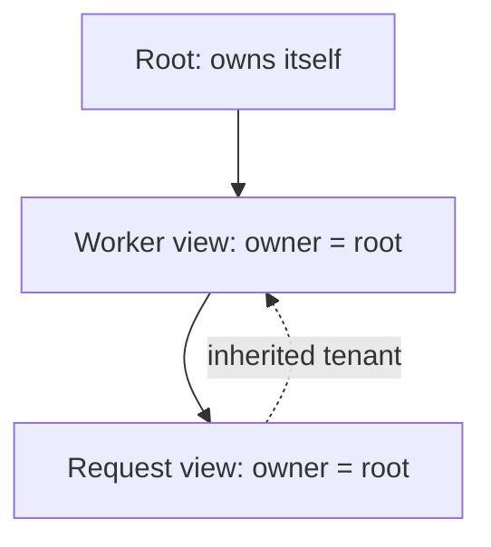

# Context foundation — Phase 1

A Context is an explicit view of application scope. Constructing one is
synchronous, has no side effects and requires no running event loop.

```python
from pycordis import Context

root = Context()
worker = root.extend({"label": "worker", "tenant": "demo"})
request = worker.extend({"label": "request"})

assert request.parent is worker
assert request.root is root
assert request.owner is root
assert request.metadata["tenant"] == "demo"
assert request.metadata["label"] == "request"
assert worker.metadata["label"] == "worker"
```



## Public API

| API | Contract |
|---|---|
| Context() | Independent root; parent is None; root and owner are itself |
| parent | Immediate source view, read-only |
| root | Shared root Context, read-only |
| owner | Owning Context identity, read-only; not a Fiber or cleanup handle |
| metadata | Read-only Mapping[str, object], local entries over inherited entries |
| extend(meta=None) | Distinct child; same root/owner; shallow-copied mapping entries |

The `owner` context will be the scope where a future Fiber is bound. Phase 1
roots own themselves and ordinary extensions inherit that identity. Parentage
alone does not mean lifecycle ownership: extending a view never creates a new
plugin instance, allocates a task or registers cleanup.

No `get`, `provide`, `plugin`, `effect`, `dispose`, isolation or interception API
exists yet. Metadata is not a service registry. Those contracts require their
own phases and tests.

## Inheritance and collisions

The mapping passed to extend is copied, so later changes to its entries do not
change the child. Entry values retain their identity: mutating a shared list or
resource object is visible through every context holding it. Read-only mappings
prevent rebinding/deleting entries; they do not make values immutable.
None and False are ordinary local values and shadow ancestor entries.

Metadata keys may match Context members (for example "root" or "extend") because
metadata is accessed only through `ctx.metadata[key]`. This prevents accidental
replacement of ownership properties or APIs. Missing keys raise KeyError;
normal Mapping.get can be used for optional metadata. Non-mapping input or
non-string keys raises TypeError before a child is created.

The metadata namespace is deliberately separate from future service access.
Prefer explicit service get/provide when the service phase arrives; attribute
service lookup and its collision/injection rules remain deferred.

## Python and TypeScript differences

Cordis creates prototype-inherited objects and copies own property descriptors.
This Python implementation retains explicit parent links and read-only mapping
views. It does not port JS descriptor/getter metadata, symbol keys, proxy-based
service tracing, root built-in services or a root Fiber yet.

extend preserves the Python class without rerunning its constructor. Class
methods remain available, but arbitrary subclass instance attributes are not
inherited from the parent. Keep view metadata in the metadata mapping; subclasses
requiring separately initialized instance state are outside this foundation's
supported extension contract. Root subclasses must call super().__init__().

## Concurrency

There is no global current Context and no implicit task-local ownership yet.
Pass the context explicitly between coroutines. Independent roots and sibling
views remain separate across awaits. Shared mutable values still require the
caller's synchronization policy. This is not a thread-safety guarantee for
resources carried in metadata. contextvars belongs to later execution ownership
work, not to metadata inheritance.

## Verification and next step

The Context tests cover hierarchy, identity, copied entries, inherited and
shadowed values, API immutability, invalid input, subclass behavior, and explicit
scope across concurrent async tasks. No cleanup or disposal behavior is claimed.
The next phase is the Fiber lifecycle state machine, reviewed against Harness
reentrant disposal and dependency epoch semantics before implementing it.
