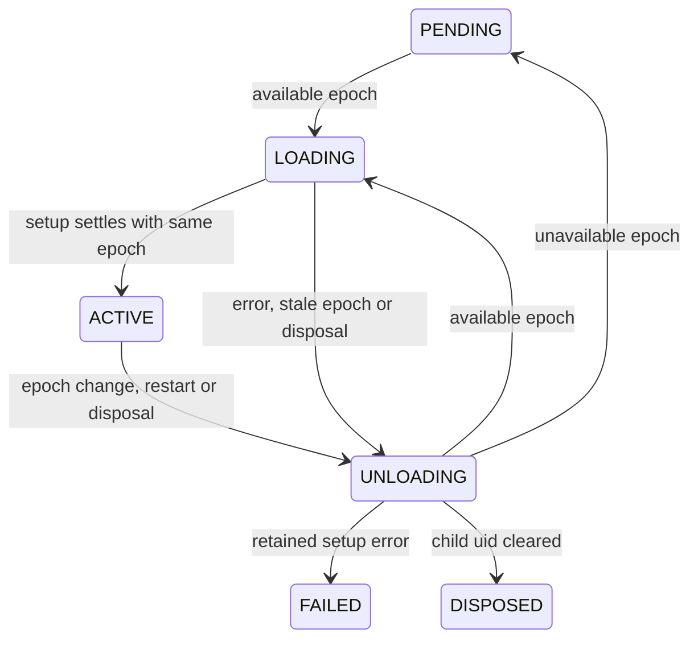

# Fiber lifecycle

Fibers own plugin setup, reversible effects and nested mounts. Context.plugin
is the normal mounting API; direct Fiber construction remains a low-level option.
See the [effect engine](effects.md). The reference remains Harness
639ed015397290b3745d163aafe02ffee4aa3f84, fiber.ts and its local lifecycle patches.

```python
import asyncio
from deepseek_cordis import Context, Fiber


async def setup(ctx: Context, config: object) -> object:
    print("start", ctx.fiber.name)
    return lambda: print("stop")


async def main() -> None:
    root = Context()
    fiber = Fiber(root, setup, name="example")
    await fiber
    await fiber.restart()
    await fiber.dispose()
    await root.fiber.dispose()


asyncio.run(main())
```

## Public API

| API | Contract |
|---|---|
| ctx.fiber | Root Fiber or mounted owner; inherited by ordinary extensions |
| Fiber(parent, setup, config=None, name=None) | Low-level eager mount on running loop; callback receives ctx/config |
| fiber.ctx | New owning Context under parent; its ordinary extensions share this Fiber |
| fiber.parent | Mounting Context |
| fiber.uid | Root 0; child uid per root; None once child disposal requested |
| fiber.state | Read-only six-state enum with Harness numeric values |
| fiber.config | Latest resolved config; raw input until first successful validation |
| fiber.raw_config | Original caller input by identity, revalidated each activation |
| fiber.error | Retained setup failure; cleared after successful activation |
| fiber.cleanup_errors | Immutable snapshot of contained cleanup failures over lifetime |
| await fiber / fiber.wait() | Settle current transitions; return Fiber or raise setup failure |
| fiber.restart() | Immediately request unload/reload; return the same awaitable Fiber |
| fiber.dispose() | Immediately request disposal; returned awaitable joins teardown |
| fiber.add_cleanup(callback) | Minimal owned callback registration; no manual disposer returned |

Setup may be sync/async and return None, cleanup callbacks, generators or
composed effect results. It is registered as a labeled effect and uses the shared
effect runner. Registry mounts normalize plugin forms and activate from required
service bindings. Direct Fiber construction has no plugin declaration/validator.
Internal/plugin/status publication notifications remain unimplemented.

## Transitions



A private _set_epoch accepts a provider-uid tuple or None. It lets tests exercise
lifecycle inputs before services exist; it is not public dependency injection.
Same-epoch refresh is ignored. A provider identity change requests reload.
Changes during setup wait for setup, then compare the latest epoch to the run's
captured epoch. A change back to that same epoch can preserve the activation.
Restoration during teardown waits for teardown before the next load.

A pending Fiber is already settled: awaiting it does not wait for future
providers. Setup/config is not run for an unavailable epoch or a child disposed
before the first checkpoint. Failure sets FAILED after rollback; wait rethrows
its error. Like the inspected Harness (unlike newer upstream's failure latch),
an available epoch can retry a failed Fiber. Explicit restart can also retry
when its dependency epoch is available.

## Ownership and teardown

Root Context constructs an ACTIVE root Fiber synchronously without a loop.
Ordinary extend views inherit root/owner/Fiber. A child mount creates a fresh
context which owns itself and binds the child Fiber; children mounted below
that context are registered in its Fiber before any setup can execute.

add_cleanup is legal while PENDING, LOADING, ACTIVE and FAILED. Registration is
rejected during UNLOADING or after child disposal. Setup-returned cleanup is
retained even if disposal was requested while setup was awaiting.

Teardown snapshots callbacks in reverse registration order and awaits them
concurrently; completion order is not globally LIFO. Each callback error is
logged and retained without starving siblings. Child disposal removes its
parent cleanup registration after teardown settles. A parent snapshot joins
child disposal already in flight. Repeated child disposal also joins, and never
runs its cleanup twice. This joined repeated await is a deliberate Python API
adaptation from Harness's single-shot public effect disposer.

Root fiber.dispose retains restart semantics: it drains registered callbacks
and children and returns ACTIVE with uid 0. It is not a terminal runtime close.
There is no Context.dispose yet; terminal shutdown must be a later deliberate
API decision. Child disposal is terminal and does not raise prior setup failures;
await fiber continues to surface them, as the source retains that diagnostic.

## Python async choices

Mount/transition requests require one running loop. The root becomes loop-bound
on first mounting/transition work. Moving a live runtime between loops raises
RuntimeError; no lock is intended to protect use from another thread.

One private Task per Fiber serializes transitions. Requests mutate the desired
epoch immediately, so calls made without awaiting still invalidate stale work.
The returned disposal object creates its coroutine only when awaited; dropping
a request creates no unawaited-coroutine warning. Waiters shield the transition
Task: cancellation of a caller does not cancel setup/teardown. A setup callback
that raises CancelledError is a retained setup failure and triggers rollback.
Setup tasks are not forcibly cancelled on dependency loss or disposal, matching
the source's wait-for-setup behavior; a callback that never settles blocks drain.

Python async callbacks begin in scheduled tasks after a checkpoint, rather than
JavaScript's synchronous prefix of an async function. This timing difference is
intentional. No promise wrapper mutates a second Fiber identity.

A private contextvars execution path detects awaiting your own or an ancestor's
in-flight lifecycle from setup/cleanup and raises CordisError(REENTRANT_AWAIT).
The disposal request still takes effect. This prevents an unavoidable cycle:
cleanup cannot finish until dispose finishes, while dispose is waiting for that
cleanup. Request `ctx.fiber.dispose()` without awaiting inside setup if the
outer owner is responsible for waiting. External waiters may join safely.
This contextvar tracks lifecycle execution only; full effect/proxy tracing is
still deferred.

## Test evidence and limits

30 Fiber cases cover root/owner identity, sync/async setup and cleanup, pending
settlement, pre-checkpoint invalidation, rollback, failure recovery, invalid
returns, reverse-start concurrent cleanup and error containment, double-disposal
joining, parent/child races, provider epoch changes, reentrancy, waiter and setup
cancellation, registration rejection, root restart, loop binding, and no
remaining lifecycle Tasks after a complete drain. Together with previous tests,
55 cases pass on Python 3.11.15. TypeScript suites were inspected, not executed.

At Phase 2, reactive service visibility, isolation, config validation, background
task ownership, publication observers and registry identity were not implemented.
Later phase sections below describe the subsequent additions. Effect setup barriers, nested generators and async cleanup joining now have
Phase 3 tests; see effects.md for their contracts and deviations.

## Reactive dependencies (Phase 5)

Registered mounts now derive their epochs from required service bindings.
Missing dependencies settle PENDING; await never waits for a future provider.
Provider activation schedules consumers; await those consumers separately to
settle their work. Availability loss invalidates loading and unloads active
consumers, retaining their original binding snapshot until teardown completes.
Restoration loads a new snapshot. Restart rechecks requirements. Direct Fiber
mounts remain the low-level API without declarations or registry notifications.

## Configuration validation (Phase 10)

Validation runs after the loading checkpoint and dependency snapshot, before
setup. Failure uses existing FAILED/error/draining behavior; restart validates raw
input again. A disposed or stale activation never enters setup. Direct low-level
Fibers have no validator. Read [config.md](config.md) for the protocol and boundaries.
