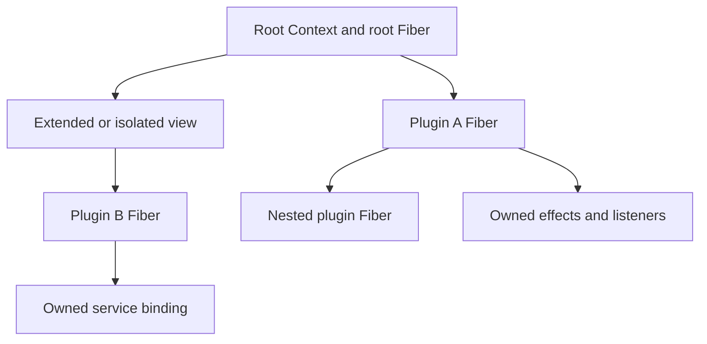
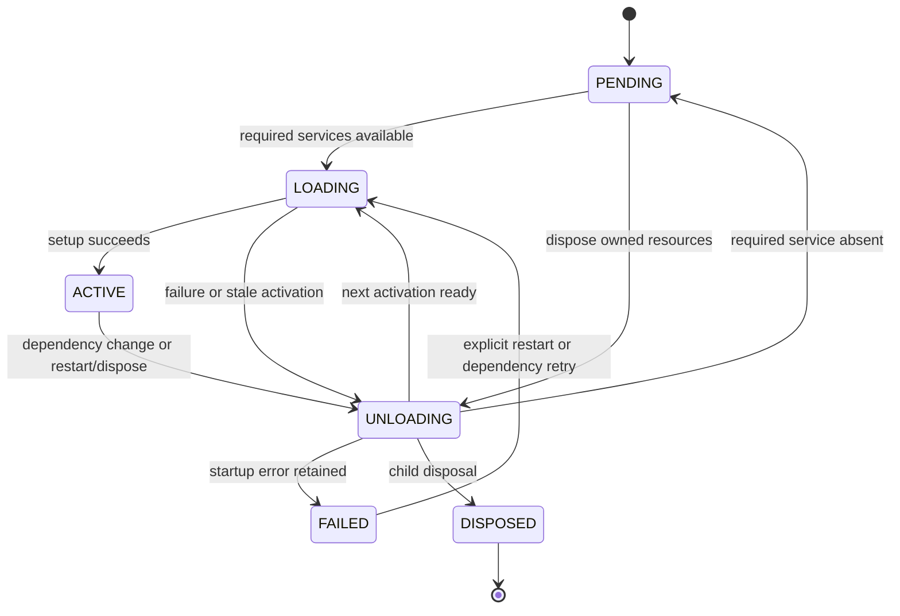

# The runtime mental model

Start with ownership: a plugin creates resources, and its Fiber owns the work
needed to release them. Dependencies decide when that plugin can run. Context
is the view through which it creates resources and reads services.

## Four objects, four jobs

| Object | What it does | What it does not create by itself |
|---|---|---|
| Context | Carries metadata, service scope labels and caller configuration; exposes runtime APIs | A new lifetime when you extend/isolate/intercept |
| Fiber | Owns one mount's setup, cleanup, dependencies, state and configuration | A singleton shared by all mounts of a callback |
| PluginRuntime | Groups mounts with the same executable callback in one root registry | Shared resources or config between those mounts |
| Effect | Collects reversible setup and gives its owner a cleanup handle | An independent owner for unrelated background Tasks |

A root Context already owns an ACTIVE root Fiber. Ordinary views keep that owner.
Mounting with ctx.plugin creates a child Fiber and a new owning Context. A child
mounted from a plugin belongs to that plugin, even when it is still PENDING.



The view shares root ownership; B is a sibling of A. Disposing A drains C and E.
Disposing B removes S. Root disposal drains both branches, then restarts the root.

## Mounting settles current work

ctx.plugin returns a Fiber immediately, after registering child ownership. Plugin
setup is scheduled on the running event loop. Awaiting the Fiber settles its current
transition and returns the same object, or rethrows its retained startup error.
A mount without dependencies can activate; a mount with missing dependencies stays
PENDING. Awaiting PENDING returns: it does not wait indefinitely for a future provider.

Two mounts of one callback share a PluginRuntime but have separate Fibers, configs,
service snapshots, listeners and effects. Registry identity uses the executable,
including the instance/function pair for Python bound methods. Metadata display
names and loader row IDs do not change callback identity.

## Dependencies create activation windows

A provider registers a named binding owned by its Fiber. Loading providers are not
available to dependents until ACTIVE. An injected consumer receives a snapshot of
its required bindings during setup. ctx.require reads that snapshot and compatible
ancestor-owned bindings; ctx.get reads the current visible service without requiring
an injection declaration. These explicit APIs replace JavaScript property proxies.

When a required provider disappears, the consumer unloads. Its old snapshot stays
available through cleanup so it can release resources tied to the old implementation.
A replacement provider causes another activation with a new snapshot. Setup and
cleanup cannot overlap for the same Fiber. Binding generations detect replacement
even when the provider Fiber itself stays the same.



This diagram describes mounted child Fibers. Child disposal is terminal; root
Fiber disposal uses unload/reload and returns the root to ACTIVE with uid 0.
Registry removal occurs when child disposal is requested, before cleanup finishes.
Await the disposal handle to know teardown has joined.

## Resources are reversible setup

A plugin can return a cleanup callback, an awaitable result, or a supported sequence
of resources. ctx.effect runs setup and collects its returned/yielded cleanup.
Listeners and service bindings are owned effects too. The owner joins unfinished
setup before it can finish cleanup; a waiter cancellation does not cancel that
lifecycle work. No implicit stop, close or destructor method is invoked.

Cleanup within one collected effect runs in reverse order. Top-level resources
start cleanup in reverse registration order and may finish concurrently. Python
nested cleanup deliberately drains remaining callbacks after a failure. Fiber
cleanup failures are logged/retained; setup failures are retained and rethrown by
await/wait. See [effects](effects.md) for generator and error details.

An Effect is both callable and awaitable, with different meanings:

```python
handle = ctx.effect(setup)
await handle  # settle setup; keep the resource alive
cleanup = handle()  # request manual removal
if cleanup is not None:
    await cleanup  # join asynchronous removal
```

This is an API fragment inside async plugin/application code. Public handles are
single-shot. Automatic owner teardown still joins removal already in progress.
Do not await your own or an ancestor's lifecycle from its setup/cleanup; cycle guards
raise REENTRANT_AWAIT. Request restart there, then let an external caller await it.

## Services, scopes and caller configuration

Service is a convenience base for registering an instance. Mount a subclass to run
its constructor and optional start hook; declared dependencies and async start gate
availability. Restart creates a new instance. Direct construction registers an
instance but does not call start automatically.

isolate changes one service's identity label, hiding other implementations for that
name. Reuse ScopeLabel to share a slot between views. intercept adds service-specific
operation options; it does not create middleware or transform every service call.
Service.resolve_config chooses explicit ctx, current_context(), then its defining
context, and merges base, ancestor layers and head.

with caller.scope() supplies task-local caller configuration. Service.ctx remains
the defining owner, so effects created through it still belong to the provider.
Retained methods are ordinary Python methods. Scoped events need an explicit
filter such as service.matches_scope; isolation does not filter every emission.

Plugin configuration is separate: a declared synchronous validator resolves raw
input before each activation, including defaults/transforms. Fiber.raw_config keeps
input identity and Fiber.config exposes the last successful resolution. Operation
intercepts are not automatically fed into that validator.

## Events and the optional loader

emit and bail call synchronous listeners inline; use parallel or serial for async
callbacks. parallel settles every listener and aggregates errors. serial/bail stop
at a meaningful result: only None and False mean continue, so zero/empty values
can stop dispatch. waterfall lets listeners wrap a zero-argument next_ continuation.
Arguments stay fixed along the chain; a listener that skips next_ vetoes the tail.

Events use root-shared listener snapshots. Registration belongs to the listener's
owner; unloading removes it. A running async dispatch belongs to its caller and
is not automatically joined by owner disposal.

Loader supplies explicit imports and ordered batches over these same APIs. Every
batch has an owner Fiber, and its handle exposes real entry Fibers. It mounts all
rows before settlement so consumers may precede providers. Batch failure rolls
back mounted resources; ordinary Python module import side effects are not reversible.
Missing dependencies can remain PENDING after loading. See [loader](loader.md).

## What to read next

Run the [examples](../examples/README.md) in order. For detailed contracts, use
[Context](context.md), [plugins](plugins.md), [services](services.md),
[events](events.md), [scope](scope.md), [configuration](config.md) and
[the compatibility matrix](compatibility.md). The pinned source catalog identifies
where Python adapts a source test and where behavior remains unimplemented.
